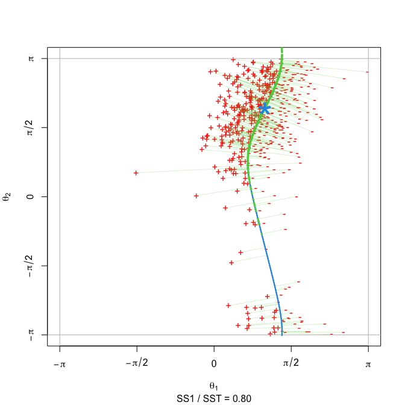
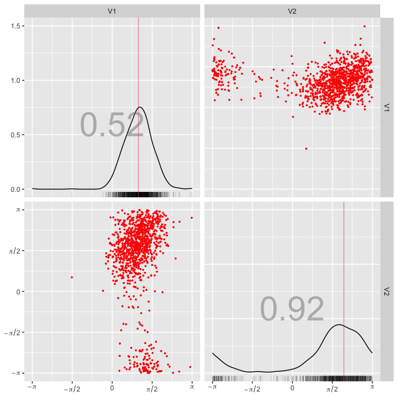
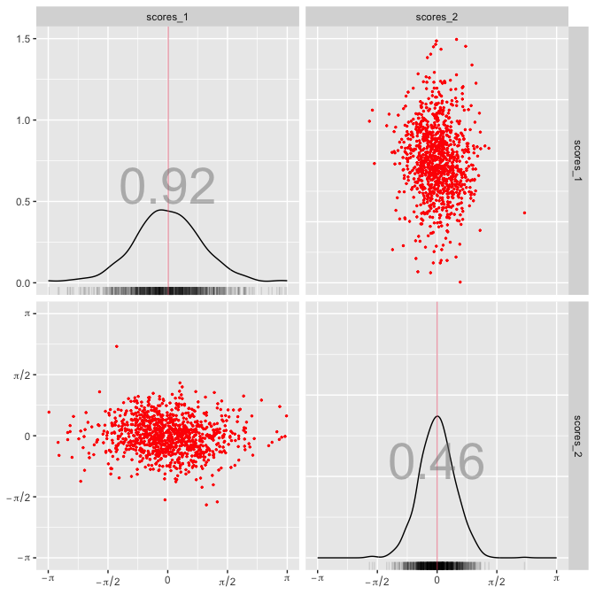
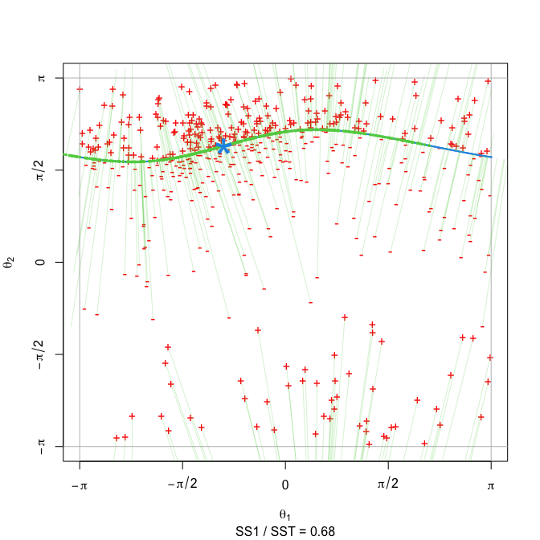
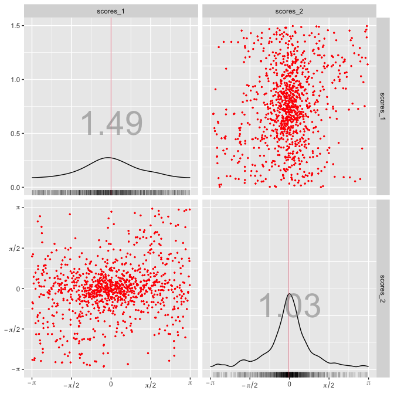
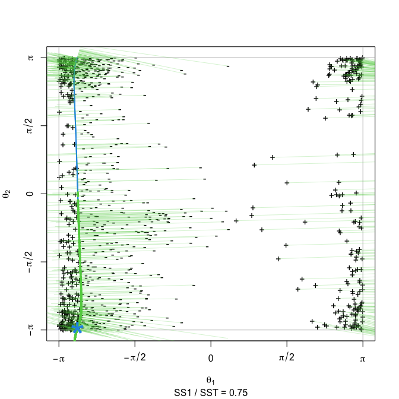
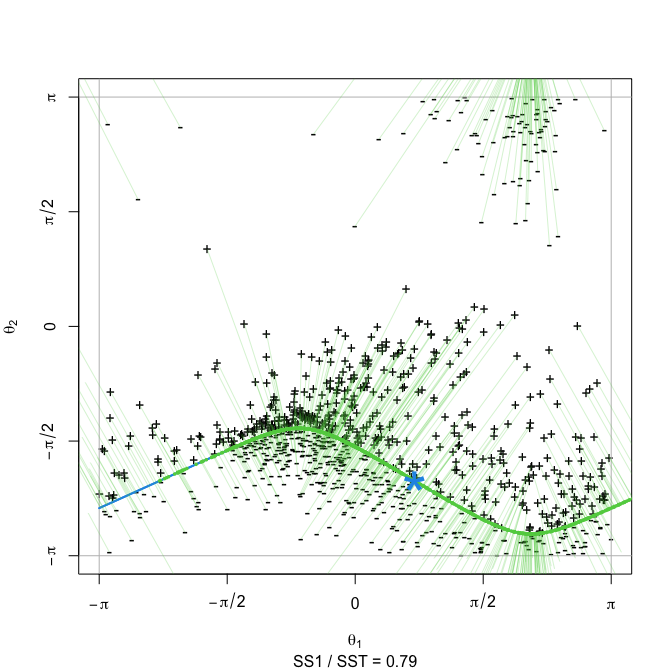

# ridgetorus

[](https://www.gnu.org/licenses/gpl-3.0)
[](https://github.com/egarpor/ridgetorus/actions)
[](https://app.codecov.io/gh/egarpor/ridgetorus)
[](https://cran.r-project.org/package=ridgetorus)
[](https://cran.r-project.org/package=ridgetorus)
[](https://cran.r-project.org/package=ridgetorus)

<!--  -->

## Overview

Implementation of principal component analysis on the two-dimensional
torus $\mathbb{T}^2=[-\pi,\pi)^2$ via density ridges. Software companion
for the paper “*Toroidal PCA via density ridges*” (García-Portugués and
Prieto-Tirado, 2022).

## Installation

Get the latest version from GitHub:

``` r
# Install the package
library(devtools)
install_github("egarpor/ridgetorus")

# Load package
library(ridgetorus)
```

## Usage

The main functionality of `ridgetorus` is the function `ridge_pca()`,
which can be employed to do dimension reduction via the bivariate sine
von Mises (Singh et al., 2002) and the bivariate wrapped Cauchy (Kato
and Pewsey, 2015) models, as the following examples show.

### Bivariate sine von Mises

``` r
# 1. Simulate data from r_bvm()
data <- r_bvm(n = 1000, mu = c(1, 2), kappa = c(5, 2, 1.5))

# 2. Do ridge_pca()
rpca <- ridge_pca(x = data, type = "bvm")

# 3. Plot simulated data with ridge fit using show_ridge_pca()
show_ridge_pca(rpca, col_data = "red")
```



``` r

# 4. Plot pairs plots of original data and scores with torus_pairs()
torus_pairs(data, col_data = "red", bwd = "EMI")
```



``` r
torus_pairs(rpca$scores, col_data = "red", bwd = "EMI", scales = rpca$scales)
```



### Bivariate wrapped Cauchy

``` r
# 1. Simulate data from r_bwc()
data <- r_bwc(n = 1000, mu = c(-1, 2), xi = c(0.3, 0.6, 0.25))

# 2. Do ridge_pca()
rpca <- ridge_pca(x = data, type = "bwc")

# 3. Plot simulated data with ridge fit using show_ridge_pca()
show_ridge_pca(rpca, col_data = "red")
```



``` r

# 4. Plot pairs plots of original data and scores with torus_pairs()
torus_pairs(rpca$scores, col_data = "red", bwd = "EMI", scales = rpca$scales)
```



## Data application in oceanography

The data applications in García-Portugués and Prieto-Tirado (2022) can
be reproduced through the script
[data-application.R](https://github.com/egarpor/egarpor/blob/master/application/data-application.R).
The code snippet below illustrates the toroidal PCA analysis onto
currents of four zones at Santa Barbara strait. Zone A and B are on the
northern coast of Santa Barbara Channel while zone C and D, are at the
top and bottom ends of the interisland channel.

``` r
# Load data
data("santabarbara")

# Example with zone A-B with automatic comparison between bvm and bwc
rpca_AB <- ridge_pca(x = santabarbara[c("A", "B")], type = "auto")
show_ridge_pca(fit = rpca_AB, col_data = "black", n_max = 1e3)
```



``` r
torus_pairs(santabarbara[c("A", "B")], col_data = "black")
```


``` r
torus_pairs(rpca_AB$scores, col_data = "black", scales = rpca_AB$scales)
```


``` r
rpca_AB$type
#> [1] "bwc"
rpca_AB$var_exp
#> [1] 0.7450665 1.0000000

# Example with zone C-D with automatic comparison between bvm and bwc
rpca_CD <- ridge_pca(x = santabarbara[c("C", "D")], type = "auto")
show_ridge_pca(fit = rpca_CD, col_data = "black", n_max = 1e3)
```



``` r
torus_pairs(santabarbara[c("C", "D")], col_data = "black")
```


``` r
torus_pairs(rpca_CD$scores, col_data = "black", scales = rpca_CD$scales)
```


``` r
rpca_CD$type
#> [1] "bvm"
rpca_CD$var_exp
#> [1] 0.7934003 1.0000000
```

It can be seen how the bivariate von Mises and the bivariate wrapped
Cauchy are the most adequate fits for zones C–D and A–B, respectively.
Toroidal PCA explains around 75% of the total variance in both cases,
motivating its use for dimension reduction. The scores also transform
the data distribution, reducing noise and allowing to check for groups
or outliers, if any.

## References

García-Portugués, E. and Prieto-Tirado, A. (2022). Toroidal PCA via
density ridges. *arXiv:2202.XXXXX*. <https://arxiv.org/abs/2202.XXXXX>.

Kato, S. and Pewsey, A. (2015). A Möbius transformation-induced
distribution on the torus. *Biometrika*, 102(2):359–370.
[doi:10.1093/biomet/asv003](https://doi.org/10.1093/biomet/asv003).

Singh, H., Hnizdo, V., and Demchuk, E. (2002). Probabilistic model for
two dependent circular variables. *Biometrika*, 89(3):719–723.
[doi:10.1093/biomet/89.3.719](https://doi.org/10.1093/biomet/89.3.719).
